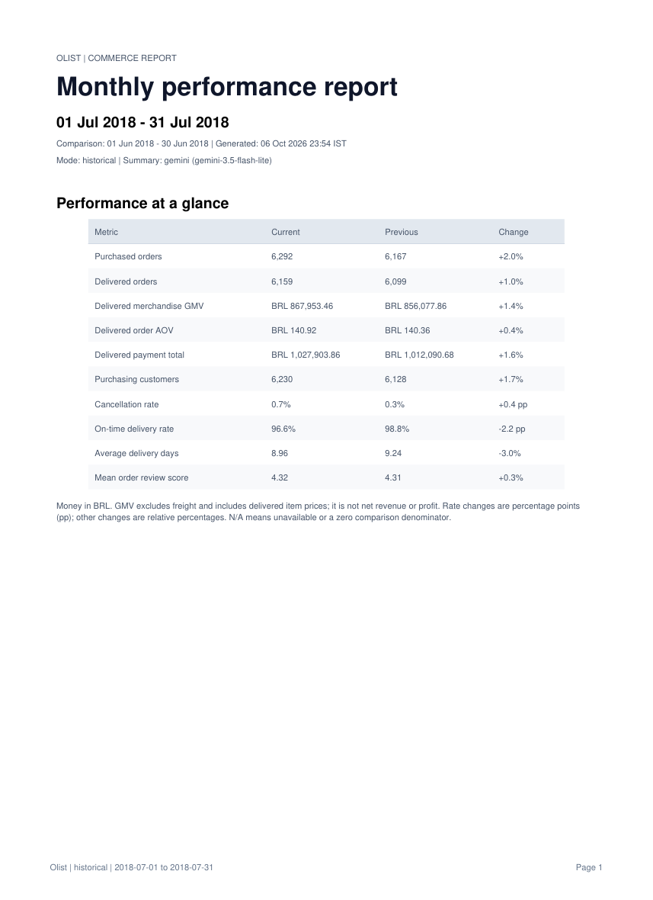
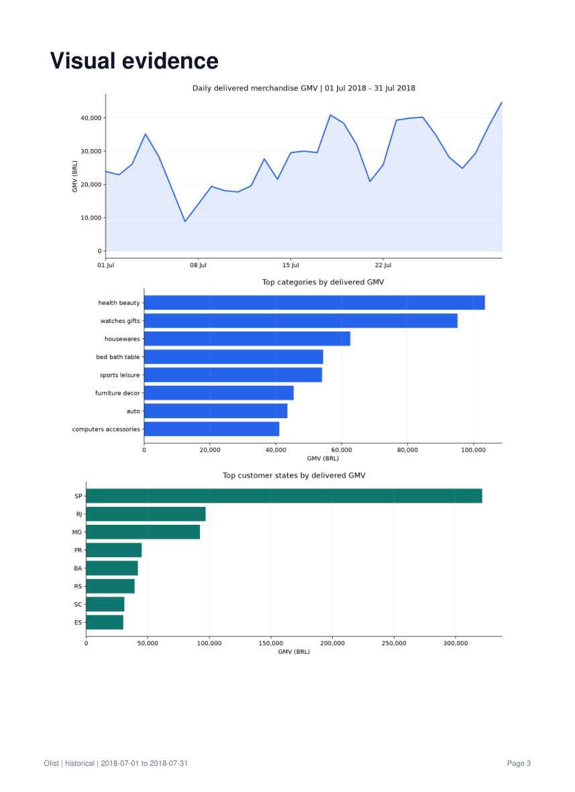

# Automated Recurring Report Generator

A complete PostgreSQL-to-PDF reporting pipeline for ecommerce: extract a reporting
period, validate the data, calculate KPIs, generate three charts, write an executive
summary, and save a dated report with supporting evidence. Windows Task Scheduler
provides weekly or monthly execution.

**Stack:** Python 3.12 · PostgreSQL · pandas · SQLAlchemy/psycopg · Matplotlib ·
Gemini API · ReportLab



**[View the complete sample PDF](sample_reports/olist_monthly_2018-07-01_2018-07-31_generated_2026-10-06.pdf)**
— four pages covering KPIs, an AI summary, charts, and methodology.

## What this project demonstrates

- Read-only SQL extraction from the existing Olist database, using a consistent snapshot.
- Separate aggregation of items, payments, and reviews to prevent join double-counting.
- Ten KPIs with current/prior-period comparisons and explicit denominators.
- Three exportable charts: daily delivered GMV, top product categories, and customer states.
- A structured Gemini summary based on calculated metrics and chart images.
- An explicitly labelled deterministic fallback when AI is disabled or unavailable.
- A dated PDF, aggregate CSV/JSON evidence, and a SHA-256 run manifest.
- A standalone runner and weekly/monthly Windows scheduling script.

## Sample results

The included PDF was generated on **6 October 2026**, comparing **July 2018** with
**June 2018**. It uses the public, anonymized
[Olist Brazilian E-Commerce dataset](https://www.kaggle.com/datasets/olistbr/brazilian-ecommerce).
This project is not affiliated with Olist.

| KPI | July 2018 | June 2018 | Change |
|---|---:|---:|---:|
| Purchased orders | 6,292 | 6,167 | +2.0% |
| Delivered orders | 6,159 | 6,099 | +1.0% |
| Delivered merchandise GMV | BRL 867,953.46 | BRL 856,077.86 | +1.4% |
| Delivered order AOV | BRL 140.92 | BRL 140.36 | +0.4% |
| On-time delivery rate | 96.6% | 98.8% | -2.2 pp |
| Mean order review score | 4.32 | 4.31 | +0.3% |

GMV sums delivered item prices and excludes freight. It is not net revenue or
profit. Rate changes use percentage points (`pp`). The sample narrative was
generated by Gemini; explanations are hypotheses, while the KPI evidence is
authoritative.

<details>
<summary>See the chart page</summary>



</details>

## Pipeline

```text
Existing PostgreSQL database
        ↓
Read-only reporting snapshot + explicit period boundaries
        ↓
Quality gates + independent GMV reconciliation
        ↓
Current/prior KPIs + three charts
        ↓
Gemini JSON summary or labelled rule-based summary
        ↓
Dated PDF + aggregate evidence + checksum manifest
        ↑
Windows Task Scheduler calls run_report.py
```

## Quick start

### 1. Use global Python 3.12

Run these commands from this project folder after cloning the repository:

```powershell
python --version
python -m pip install -r requirements.txt
```

Use your global **Python 3.12** interpreter and select it as the notebook kernel.
The project checks the Python version. A virtual environment is not required.

### 2. Configure the existing Olist database

Copy the safe template to a local `.env` and enter your own connection settings:

```powershell
Copy-Item .env.example .env
```

```dotenv
PGHOST=localhost
PGPORT=5432
PGUSER=YOUR_POSTGRES_USER
PGPASSWORD=YOUR_POSTGRES_PASSWORD
PGDATABASE=olist
GEMINI_API_KEY=
GEMINI_MODEL=gemini-3.5-flash-lite
```

The report expects the loader's `public` tables: `orders`, `customers`,
`order_items`, `order_payments`, `order_reviews`, `products`, and
`product_category_name_translation`. The existing
[data loader](data_loader.ipynb) is included as a reference; the reporting pipeline
does not reload the data or change PostgreSQL tables.

Keep `.env` private. Leave the API key blank for local report generation, or
configure your own Gemini API key for the optional AI step.

### 3. Generate a report

```powershell
# Local analysis and PDF; no API request
python run_report.py --frequency monthly --mode historical --ai off

# Gemini summary, with a labelled fallback on provider failure
python run_report.py --frequency monthly --mode historical --ai auto

# Require a working live AI summary
python run_report.py --frequency monthly --mode historical --ai required

# Weekly historical report
python run_report.py --frequency weekly --mode historical --ai off
```

For an explicit period, `--as-of 2018-08-01` is an anchor date selecting the
previous completed month, **July 2018**. Model selection is configurable with
`GEMINI_MODEL` in `.env` or the runner's `--model` option. API billing and model
availability depend on your own account.

### 4. Explore the notebook

Open [automated_recurring_report_generator.ipynb](automated_recurring_report_generator.ipynb)
and run cells from top to bottom. It contains the full implementation, phase
explanations, comments, KPI definitions, and editable configuration. Published
notebooks have their outputs cleared; the sample PDF and images show the verified
result without exposing local machine details.

The notebook's definitions are generated from `report_pipeline.py`, which the
standalone runner also uses. After changing that source:

```powershell
python make_notebook.py
python execute_notebook.py --ai off
```

Regeneration clears stored outputs. Review and clear notebook outputs again
before publishing an executed copy.

## Recurring execution

Preview a task definition, then register the selected schedule explicitly:

```powershell
powershell -NoProfile -ExecutionPolicy Bypass -File .\schedule_report.ps1 -Frequency monthly -Mode historical -Ai auto
powershell -NoProfile -ExecutionPolicy Bypass -File .\schedule_report.ps1 -Frequency monthly -Mode historical -Ai auto -Register
```

Monthly tasks run on day 1 at 09:00; weekly tasks run Monday at 09:00. `-At`
changes the time. The script verifies global Python 3.12, pins its absolute path,
sets the working directory, and prevents overlapping task instances. Trigger
times use the local Windows timezone. Registration is separate from notebook
execution; see the guide for logged-off operation and testing a scheduled run.

## Reporting periods and limitations

Olist is a static 2016–2018 dataset. The default `historical` mode replays the
latest completed calendar period before the last delivered-order purchase,
avoiding the sparse late order tail. `calendar` mode reports current dates and
is intended for an ongoing source feed; static Olist data produces an empty,
stale-source report for current dates.

Periods use inclusive starts and exclusive ends. Weeks are Monday–Sunday;
months are calendar months. Historical cohort statuses, payments, and reviews
reflect the final dataset snapshot rather than reconstructing what was known at
period end. Missing/invalid delivery observations are excluded with warnings.
AI structure is validated, but narrative hypotheses still require human judgment.

## Repository contents

| File or folder | Purpose |
|---|---|
| `automated_recurring_report_generator.ipynb` | Main tutorial and complete implementation |
| `data_loader.ipynb` | Original loading workflow, sanitized for publication |
| `report_pipeline.py` | Shared pipeline functions |
| `run_report.py` | Unattended CLI runner |
| `schedule_report.ps1` | Weekly/monthly Windows task preparation and registration |
| `make_notebook.py` / `execute_notebook.py` | Notebook generation and verification utilities |
| `tests/` | Calendar, metric, quality, empty-data, and summary edge cases |
| `sample_reports/` | Reviewed sample PDF |
| `docs/images/` | README previews rendered from that PDF |
| `.env.example` | Placeholder configuration only |

Each new run writes to `output/reports/<period>/<unique-run>/` and contains the
PDF, three PNG charts, KPI/daily/category/state CSVs, evidence and summary JSON,
and `manifest.json`. The success manifest is written last and records file
checksums and summary provenance.

## Validation and documentation

```powershell
python -m unittest discover -s tests -v
```

**Verified:** 14 tests passed; all 19 main-notebook code cells executed in Python
3.12.10; live Gemini and local fallback paths worked; monthly, weekly, and empty
calendar reports were generated; the four-page sample was visually reviewed.
Scheduler definitions were validated in memory; task registration remains a setup step.

- [Project guide](PROJECT_GUIDE.md): setup, metric dictionary, SQL grain, AI behavior,
  output structure, scheduling, and troubleshooting.
- [Execution plan](EXECUTION_PLAN.md): build milestones and ordered execution checklist.
- [Validation notes](VALIDATION.md): the checks performed and their limits.

Credentials, raw datasets, runtime reports, logs, generated scheduler XML,
notebook checkpoints, temporary files, caches, and local editor settings are
excluded from version control. Only the reviewed sample PDF and its previews
are published as generated artifacts.
