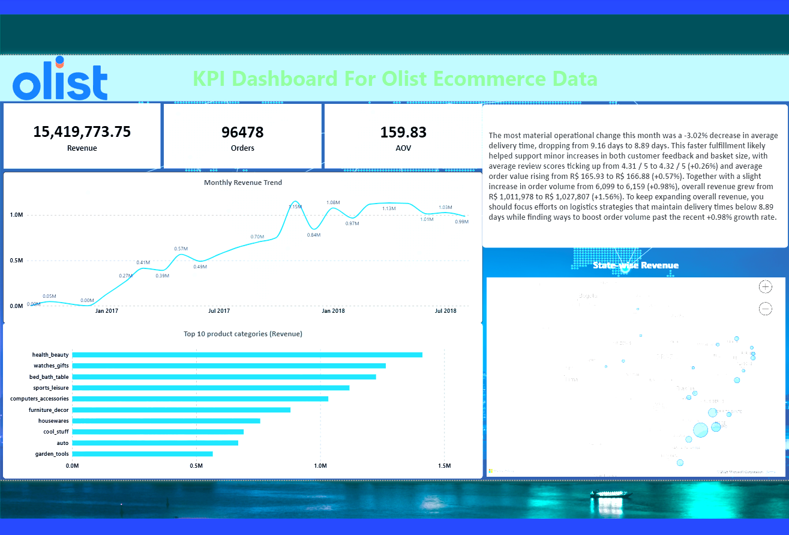

# AI-Automated E-commerce BI Dashboard

A Power BI dashboard over real e-commerce data whose executive summary is **written by an LLM and refreshes with the data** — plus an interactive AI analyst panel that re-analyses whatever slice of the data the viewer selects.

Landing page of the 

> Built on the public [Olist Brazilian E-Commerce dataset](https://www.kaggle.com/datasets/olistbr/brazilian-ecommerce) (~100K orders, 2016–2018). Not affiliated with Olist.

---

## What it does

1. **Loads** nine Olist CSVs into PostgreSQL with an explicit schema, indexes, and row-count verification.
2. **Computes KPIs** in SQL — revenue, orders, AOV, delivery time, review score — for the latest complete month against the prior month.
3. **Generates an executive summary** by sending that comparison table to Gemini with a prompt that forbids inventing numbers; every figure in the prose is traceable to the table.
4. **Persists** the summary to a Postgres table. Power BI binds a card to it, so **Refresh** pulls the newest narrative onto the canvas.
5. **AI Analyst panel** (page 2): a Python visual that, on every slicer click, re-plots the selected slice and asks Gemini for a headline, three insights, and a recommended action — rendered as one image on the dashboard.

### Sample output (July 2018 vs June 2018, auto-generated)

> The most material operational change this month was a -3.02% decrease in average delivery time, dropping from 9.16 days to 8.89 days. This faster fulfillment likely helped support minor increases in both customer feedback and basket size, with average review scores ticking up from 4.31 / 5 to 4.32 / 5 (+0.26%) and average order value rising from R$ 165.93 to R$ 166.88 (+0.57%). Together with a slight increase in order volume from 6,099 to 6,159 (+0.98%), overall revenue grew from R$ 1,011,978 to R$ 1,027,807 (+1.56%).

| metric            | current      | previous     | change  |
|:------------------|:-------------|:-------------|:--------|
| revenue           | R$ 1,027,807 | R$ 1,011,978 | +1.56%  |
| orders            | 6,159        | 6,099        | +0.98%  |
| aov               | R$ 166.88    | R$ 165.93    | +0.57%  |
| avg_delivery_days | 8.89 days    | 9.16 days    | -3.02%  |
| avg_review_score  | 4.32 / 5     | 4.31 / 5     | +0.26%  |

---

## Tools and libraries

| Component | Version used | Purpose |
|---|---|---|
| Python | 3.12 | pipeline + AI calls |
| PostgreSQL | 18 | warehouse layer |
| Power BI Desktop | Aug 2026 (2.157) | dashboard; Npgsql driver is bundled, no separate install |
| Google AI Studio | free tier | Gemini API key (no card required) |
| Kaggle account | — | dataset download |

Python packages:

```
pandas          sqlalchemy      psycopg[binary]   ipython-sql
google-genai    python-dotenv   matplotlib        tabulate
pydantic        kaggle          jupyter
```

Notes: `psycopg` (v3) is used, so SQLAlchemy URLs are `postgresql+psycopg://`. `tabulate` is required by `DataFrame.to_markdown()`, which formats the tables sent to Gemini.

---

## Files

```
.
├── data_loader.ipynb                 # Kaggle download → schema → load → verify
├── Automated_ecom_bi_summary.ipynb   # KPIs → Gemini summary → persist → panel dev harness
├── agent/
│   └── pbi_analyst_panel.py          # script run by the Power BI Python visual
├── outputs/
│   └── summary_july-2018.md          # generated summary + the table it was written from
├── KPI_Dashboard_Olist.pbix          # the dashboard (2 pages)
├── .env.example                      # template for credentials
├── .gitignore
└── README.md
```

Not committed: `.env` (secrets), `data/` (raw CSVs — re-download from Kaggle), `agent/panel_cache.json` (regenerates on first run).

---

## Setup

### 1. Clone and install

```powershell
git clone <this repo>
cd <repo>
python -m venv .venv
.venv\Scripts\activate
pip install pandas sqlalchemy "psycopg[binary]" ipython-sql google-genai python-dotenv matplotlib tabulate pydantic kaggle jupyter
```

### 2. PostgreSQL

Install PostgreSQL (18 was used; 14+ is fine). Note the password you set for the `postgres` user. The loader notebook creates the `olist` database itself.

### 3. Credentials

Copy `.env.example` to `.env` and fill in:

```
PGHOST=localhost
PGPORT=5432
PGDATABASE=olist
PGUSER=postgres
PGPASSWORD=<your postgres password>
GOOGLE_API_KEY=<from aistudio.google.com>
```

Kaggle: **kaggle.com → Settings → API → Create New Token**, save the downloaded `kaggle.json` to `%USERPROFILE%\.kaggle\kaggle.json`.

### 4. Load the data

Run **`data_loader.ipynb`** top to bottom. It downloads the dataset, creates the schema (`sql` with explicit types, primary keys, and join indexes), loads the 8 tables, and verifies row counts against the CSVs. Expected: orders 99,441 · order_items 112,650 · reviews 99,224. `geolocation` (~1M rows) is deliberately skipped — state comes from `customers`.

### 5. Generate the summary

Run **`Automated_ecom_bi_summary.ipynb`**. It computes the KPIs, builds the comparison table, calls Gemini, checks every number in the response against the table, and appends a row to `exec_summary`. It also writes `outputs/summary_<month>.md`.

To pick a model: the notebook lists what your key can reach via `client.models.list()`. Pin a stable, non-`preview`, non-`lite` Flash model in `MODEL_ID`.

### 6. Open the dashboard

1. Open `KPI_Dashboard_Olist.pbix`.
2. **File → Options → Python scripting** → set the Python home directory to your interpreter (the venv from step 1).
3. **Home → Refresh**. When prompted, choose the **Database** credential tab and enter the `postgres` user and password. Accept the unencrypted-connection warning (local server).
4. On the **AI Agent** page, select the Python visual, open the script editor, and update the path in the `exec(open(r"...pbi_analyst_panel.py"))` line to where you cloned the repo. Click **Run script**.

### 7. See it refresh itself

Re-run the Gemini and insert cells in the notebook, then **Refresh** in Power BI. The executive summary card updates. That loop is the whole point.

---

## The dashboard

### Page 1 — Landing Page

| Visual | What it shows |
|---|---|
| Revenue · Orders · AOV cards | Headline KPIs, delivered orders only |
| Monthly Revenue Trend | Continuous time series, Sep 2016 – Jul 2018 |
| Top 10 product categories | Revenue by English category name |
| Delivery time vs review score | Average review score by delivery-time bucket — satisfaction falls sharply past two weeks |
| State-wise Revenue | Bubble map by customer state |
| **Executive Summary** | Card bound to the latest `exec_summary` row via a DAX measure; regenerated by the notebook, refreshed by Power BI |
| Generated timestamp | Proves the text is machine-written and current |

### Page 2 — Python Viz

Slicers for **product category** and **customer state** drive a Python visual. On each selection the script receives the filtered monthly KPIs, plots revenue, and asks Gemini (structured JSON output) for a headline, three insights each citing a number from the data, and a recommended action. Responses are cached by prompt hash, so a slice is only sent to the API once.

### Model

Seven relationships, all many-to-one, single direction. `exec_summary` is intentionally unrelated to every other table. Measures compute the `delivered`-only filter internally via `CALCULATE`, so correctness travels with the measure rather than depending on a page filter.

Key DAX:

```dax
Revenue = CALCULATE ( SUMX ( order_items, order_items[price] + order_items[freight_value] ),
                      orders[order_status] = "delivered" )

Latest Summary =
VAR LatestRun = CALCULATE ( MAX ( exec_summary[generated_at] ), ALL ( exec_summary ) )
RETURN CALCULATE ( MAX ( exec_summary[summary_text] ), ALL ( exec_summary ),
                   exec_summary[generated_at] = LatestRun )
```

---

## Design decisions worth knowing

- **Revenue = `price + freight_value` at line-item level**, delivered orders only. Olist also has `payment_value`, which includes vouchers and installments and doesn't attribute to a category; the two don't reconcile, so one was chosen and held throughout.
- **"Latest month" is derived from the data**, not from today's date. The final month in the dataset is partial and is excluded from comparisons.
- **The AI cannot invent numbers.** The prompt supplies a formatted table and instructs the model to cite only figures present in it; the notebook then checks every number in the response against the table.
- **Thinking is constrained on the Gemini call.** Left at default, reasoning tokens expand to fill `max_output_tokens` and truncate the answer; `thinking_level=MINIMAL` prevents it.
- **Desktop-only for the AI panel.** Python visuals in Power BI Service run sandboxed with no network access. Page 1 works anywhere; page 2 needs Desktop and a local interpreter.

## Data

Olist Brazilian E-Commerce Public Dataset, Kaggle, CC BY-NC-SA 4.0. Covers Sep 2016 – Aug 2018. All monetary values in Brazilian reais (BRL). This project is not affiliated with Olist.


---

## Project 2: Automated Recurring Report Generator

[Explore the full reporting pipeline](automated-recurring-report-generator/README.md):
PostgreSQL → quality checks → KPIs/charts → Gemini summary → dated PDF → Windows scheduling.
The notebook and standalone runner use global Python 3.12 and require no dashboard tool.

[View the four-page sample report](automated-recurring-report-generator/sample_reports/olist_monthly_2018-07-01_2018-07-31_generated_2026-10-06.pdf).
